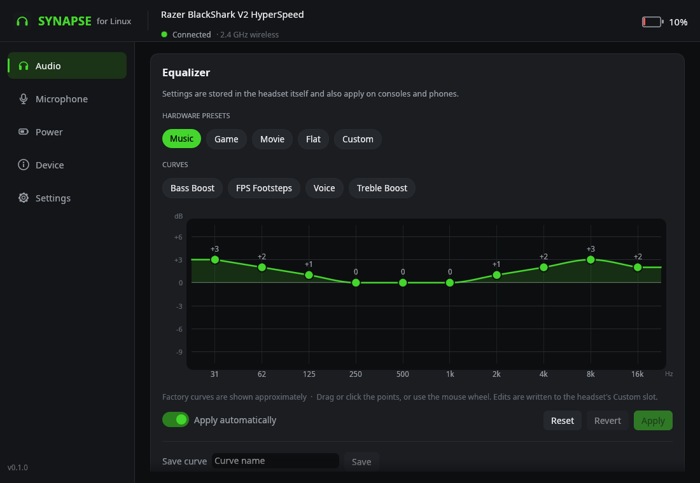
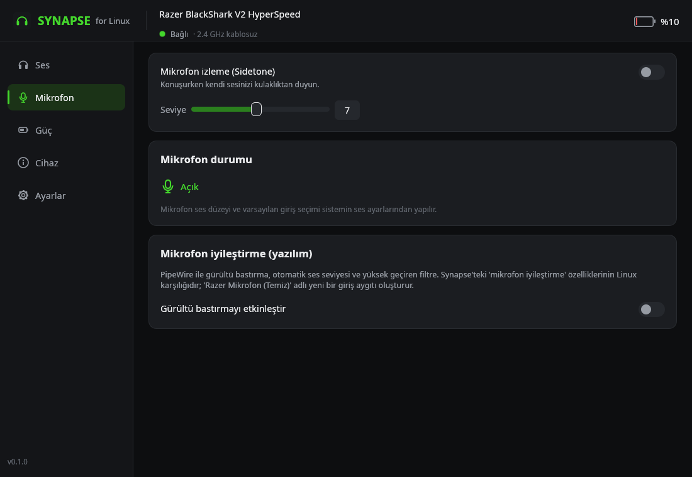
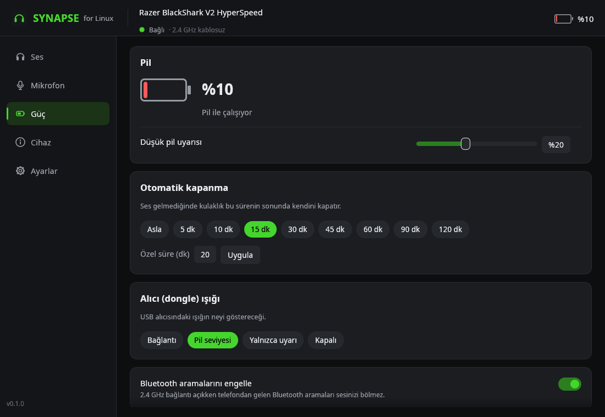

<p align="center">
  
</p>

<h1 align="center">Synapse for Linux</h1>

<p align="center">
  An independent, open-source take on Razer Synapse — for Linux.<br>
  Configure your Razer headset without Windows and without a kernel module.
</p>

<p align="center">
  <a href="README.tr.md">🇹🇷 Türkçe</a> ·
  <a href="#install">Install</a> ·
  <a href="#supported-devices">Supported devices</a> ·
  <a href="#features">Features</a> ·
  <a href="CONTRIBUTING.md">Contributing</a>
</p>

> [!IMPORTANT]
> **Not affiliated with Razer.** Synapse for Linux is a community project *inspired by*
> Razer Synapse. It is not made, endorsed or supported by Razer Inc., and it contains
> no Razer code, logos, images or other files — nothing beyond that inspiration. We simply
> want the spirit of Synapse to live on on Linux too. "Razer", "Synapse", "BlackShark" and
> "HyperSpeed" are trademarks of Razer Inc. and are used here only to say which hardware
> this software works with.



## Why?

Razer Synapse only runs on Windows, so on Linux there was no way to change a Razer
headset's equalizer, mic monitoring or auto power-off, or even to see its battery level.
Synapse for Linux brings those controls to Linux. It talks to the device directly over USB
HID (the same channel Synapse uses), so no drivers or kernel modules are needed. Settings are
stored in the headset itself, so they also apply on your console, phone and Windows PC.

## Supported devices

| Device | USB ID | Connection | Status |
|---|---|---|---|
| Razer BlackShark V2 HyperSpeed | `1532:0565` | 2.4 GHz HyperSpeed dongle | ✅ Tested on real hardware |
| Razer BlackShark V2 HyperSpeed | `1532:056E` | USB cable | 🟡 Should work, not yet tested |
| Razer BlackShark V2 HyperSpeed (variant) | `1532:0566` | 2.4 GHz dongle | 🧪 Experimental |

Find your device's USB ID with `lsusb | grep 1532`. Is your Razer device missing? Please
[open a device request](https://github.com/bbesli/Synapse-for-Linux/issues/new?template=device_support.md) —
new devices are the most valuable contribution (see [CONTRIBUTING.md](CONTRIBUTING.md)).
Razer mice and keyboards are already covered on Linux by [OpenRazer](https://openrazer.github.io/).

## Features

| | Synapse (Windows) | Synapse for Linux |
|---|:---:|:---:|
| EQ presets (Game, Music, Movie) | ✅ | ✅ plus Flat and the Custom slot |
| 10-band custom EQ | ✅ | ✅ drag-and-drop curve editor (−9…+6 dB), built-in and saved curves |
| Mic monitoring (sidetone) | ✅ 0–10 | ✅ on/off, levels 0–15 |
| Battery level and charging state | ✅ | ✅ in the window and the tray, low-battery and fully-charged notifications |
| Auto power-off | ✅ | ✅ 1–255 minutes or never |
| Dongle light | ✅ | ✅ link / battery level / warnings only / off |
| Block Bluetooth calls while on 2.4 GHz | ✅ | ✅ |
| Audio enhancement, EQ on/off | ✅ | ✅ |
| Mic mute status | ✅ | ✅ read-only |
| Mic enhancement (noise reduction, volume normalization) | ✅ | ✅ optional, through PipeWire + WebRTC |
| THX Spatial Audio | ✅ | ❌ proprietary Windows software |
| Firmware updates | ✅ | ❌ not supported (use Synapse on Windows if you need one) |
| Mic equalizer, cloud profiles | ✅ | ❌ not yet |

Also included: a system tray icon (battery level, quick EQ and sidetone switching), the
`synapsectl` command-line tool, an English and Turkish interface, and a simulation mode for
trying everything without hardware.

<details>
<summary>More screenshots</summary>

| Microphone | Power |
|---|---|
|  |  |

</details>

## Install

### Quick install (any distribution, x86_64)

```bash
curl -fsSL https://github.com/bbesli/Synapse-for-Linux/releases/latest/download/synapse-linux-x86_64.tar.gz | tar xz
cd synapse-linux-x86_64 && ./install.sh
```

This installs into `~/.local` (no root) and adds "Synapse for Linux" to your application
menu. It asks for your password once, with `sudo`, to install the [udev rule](#device-access-udev-rule).
Options: `--autostart` (start the tray icon at login), `--no-udev`, `--prefix DIR`.

Requirements: glibc 2.35 or newer (Ubuntu 22.04+, Debian 12+, Fedora 36+, Arch, CachyOS,
openSUSE Tumbleweed…) and a Wayland or X11 desktop. Optional: PipeWire (mic noise
suppression) and polkit (grant device access from the app). You can check the download
against `SHA256SUMS` on the [releases page](https://github.com/bbesli/Synapse-for-Linux/releases).

### Arch Linux / CachyOS (package from source)

```bash
git clone https://github.com/bbesli/Synapse-for-Linux.git
cd Synapse-for-Linux/packaging/arch && makepkg -si
```

### From source (any distribution)

Needs Rust 1.95 or newer ([rustup.rs](https://rustup.rs)).

```bash
git clone https://github.com/bbesli/Synapse-for-Linux.git
cd Synapse-for-Linux && ./scripts/install.sh
```

### Device access (udev rule)

`/dev/hidraw*` device files can only be opened by root by default.
[`70-synapse-linux.rules`](packaging/udev/70-synapse-linux.rules) gives the logged-in desktop
user access to Razer (`1532`) HID devices through systemd's `uaccess` tag. The installers add it
for you. If it is missing, the app notices and offers a **Grant access** button that installs it
after asking for your administrator password.

### Uninstall

```bash
~/.local/share/synapse-linux/uninstall.sh          # keeps the udev rule
~/.local/share/synapse-linux/uninstall.sh --udev   # removes the udev rule too
```

Settings stay in `~/.config/synapse-linux/`.

## Usage

- **Window:** "Synapse for Linux" in the application menu, or `synapse-linux`
- **Tray icon:** `synapse-linux --tray`. Hover it to see the battery level; right-click it to
  change the EQ preset or sidetone. To start it at login, turn on Settings → *Start the tray
  icon at login*.
- **Command line:**

```bash
synapsectl status                        # everything at once
synapsectl battery                       # e.g. 76%
synapsectl eq preset game                # music | game | movie | flat | custom
synapsectl eq set 3 2 1 0 0 0 1 2 3 2    # 10 bands in dB (−9…+6), written to the Custom slot
synapsectl eq curve bass                 # built-in curves: bass, footsteps, voice, treble
synapsectl sidetone 8                    # sidetone level 0–15, or on / off
synapsectl sleep 30                      # auto power-off in minutes, or off
synapsectl led battery                   # link | battery | warning | off
synapsectl dnd on                        # block Bluetooth calls while on 2.4 GHz
synapsectl mic-clean on                  # PipeWire noise suppression (on / off / default / status)
synapsectl --json status                 # machine-readable output
```

### Microphone enhancement (PipeWire)

On Windows, Synapse's noise reduction and volume normalization run as software on the PC,
not in the headset. Synapse for Linux uses PipeWire's WebRTC processing for the same job:
noise suppression, automatic gain and a high-pass filter. Turning it on adds a new input
device named **Razer Mic (Clean)**. Choose it in your apps (Discord, TeamSpeak, OBS…), or make
it the default input. It runs as its own PipeWire client (`synapse-linux-mic.service`), so
turning it on or off never restarts your audio. Turning it off removes everything it added.

## How it works

The BlackShark V2 HyperSpeed does not use the classic Razer protocol of mice and keyboards.
Its MediaTek-based dongle has a vendor HID interface that takes 64-byte command frames
(report ID `0x02`). Commands sent to domain `0x80` are relayed over the air to the headset.
[docs/PROTOCOL.md](docs/PROTOCOL.md) describes the full register map and what was verified on
hardware.

```
crates/
  synapse-core/   protocol, hidraw access, discovery, background device manager, config, PipeWire
  synapsectl/     command-line tool
  synapse-gui/    window (egui) and tray icon (StatusNotifierItem), built as `synapse-linux`
```

The window, the tray and `synapsectl` can all run at the same time: each request/response
exchange takes a lock in `$XDG_RUNTIME_DIR/synapse-linux/`, so they never mix up each other's replies.

## Troubleshooting

- **"No permission to access the device":** the udev rule is missing. Click *Grant access* in the
  app, or run `synapsectl udev-rule | sudo tee /etc/udev/rules.d/70-synapse-linux.rules` and then
  `sudo udevadm control --reload-rules && sudo udevadm trigger --subsystem-match=hidraw`.
- **"Headset is off or out of range":** the dongle is plugged in but the headset is off. The app
  loads its settings as soon as the headset connects.
- **The Custom EQ slot shows −5 dB on every band:** Synapse wrote a flat curve as raw zeros.
  Select *Flat*, or press *Reset* in the editor.
- **Logs:** `RUST_LOG=debug synapse-linux`, or `RUST_LOG=synapse_core=trace synapsectl status`
  to also see the raw frames.
- **No hardware at hand:** `synapse-linux --simulate` and `synapsectl --simulate status`.

## Contributing

Contributions are very welcome, whether you add a device, fix a bug, translate the app or
improve the docs. [CONTRIBUTING.md](CONTRIBUTING.md) explains how to build, test and capture the
protocol of a new device. Issues and pull requests can be written in English or Turkish.

## License and credits

[MIT](LICENSE) © 2026 Burak Beşli and contributors.

The register map of the BlackShark V2 HyperSpeed is based on the MIT-licensed reverse
engineering work in [justik13/razer-blackshark-v2-hyperspeed-webhid](https://github.com/justik13/razer-blackshark-v2-hyperspeed-webhid).
This project verified it on real hardware and extended it.

Razer, Synapse, BlackShark and HyperSpeed are trademarks of Razer Inc. This project is
independent and is not affiliated with, endorsed by or sponsored by Razer Inc.
