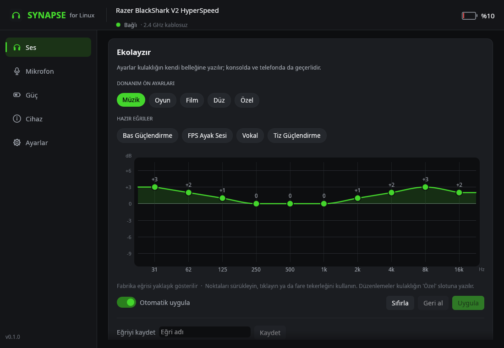

<p align="center">
  
</p>

<h1 align="center">Synapse for Linux</h1>

<p align="center">
  Razer Synapse'ten ilham alan, bağımsız ve açık kaynaklı bir Linux uygulaması.<br>
  Razer kulaklığınızı Windows'a ve kernel modülüne gerek olmadan ayarlayın.
</p>

<p align="center">
  <a href="README.md">🇬🇧 English</a> ·
  <a href="#kurulum">Kurulum</a> ·
  <a href="#desteklenen-cihazlar">Desteklenen cihazlar</a> ·
  <a href="#özellikler">Özellikler</a> ·
  <a href="CONTRIBUTING.md">Katkıda bulunma</a>
</p>

> [!IMPORTANT]
> **Razer ile bir bağlantımız yoktur.** Synapse for Linux, Razer Synapse'ten *ilham alan*
> bir topluluk projesidir. Razer Inc. tarafından yapılmamıştır, onaylanmamış ya da
> desteklenmemektedir. Razer'a ait hiçbir kod, logo, görsel veya dosya içermez; bu ilham
> dışında ekstra hiçbir şey yoktur. Tek amacımız Synapse ruhunun Linux'ta da yaşamasına
> vesile olmak. "Razer", "Synapse", "BlackShark" ve "HyperSpeed" Razer Inc.'in ticari
> markalarıdır ve burada yalnızca yazılımın hangi donanımla çalıştığını belirtmek için geçer.



## Neden?

Razer Synapse yalnızca Windows'ta çalışıyor. Linux'ta bir Razer kulaklığın ekolayzırını,
mikrofon izlemesini ya da otomatik kapanmasını değiştirmenin, hatta pil seviyesini görmenin
bir yolu yoktu. Synapse for Linux bu kontrolleri Linux'a getiriyor. Cihazla doğrudan USB HID
üzerinden (Synapse'in kullandığı kanaldan) konuştuğu için sürücü ya da kernel modülü gerekmez.
Ayarlar kulaklığın kendi belleğine yazılır, yani konsolda, telefonda ve Windows'ta da geçerli
kalır.

## Desteklenen cihazlar

| Cihaz | USB kimliği | Bağlantı | Durum |
|---|---|---|---|
| Razer BlackShark V2 HyperSpeed | `1532:0565` | 2.4 GHz HyperSpeed alıcı (dongle) | ✅ Gerçek donanımda test edildi |
| Razer BlackShark V2 HyperSpeed | `1532:056E` | USB kablo | 🟡 Çalışması beklenir, henüz test edilmedi |
| Razer BlackShark V2 HyperSpeed (varyant) | `1532:0566` | 2.4 GHz alıcı | 🧪 Deneysel |

Cihazınızın USB kimliğini `lsusb | grep 1532` ile öğrenebilirsiniz. Razer cihazınız listede
yoksa [cihaz talebi açın](https://github.com/bbesli/Synapse-for-Linux/issues/new?template=device_support.md);
yeni cihaz desteği en değerli katkıdır (bkz. [CONTRIBUTING.md](CONTRIBUTING.md)). Razer fare
ve klavyeleri Linux'ta zaten [OpenRazer](https://openrazer.github.io/) ile destekleniyor.

## Özellikler

| | Synapse (Windows) | Synapse for Linux |
|---|:---:|:---:|
| EQ ön ayarları (Oyun, Müzik, Film) | ✅ | ✅ ayrıca Düz ve Özel slot |
| 10 bantlı özel EQ | ✅ | ✅ sürükle-bırak eğri editörü (−9…+6 dB), hazır ve kayıtlı eğriler |
| Mikrofon izleme (sidetone) | ✅ 0–10 | ✅ aç/kapa, 0–15 seviye |
| Pil seviyesi ve şarj durumu | ✅ | ✅ pencerede ve tepside; düşük pil ve "şarj doldu" bildirimleri |
| Otomatik kapanma | ✅ | ✅ 1–255 dakika veya asla |
| Alıcı (dongle) ışığı | ✅ | ✅ bağlantı / pil seviyesi / yalnızca uyarı / kapalı |
| 2.4 GHz'de Bluetooth aramalarını engelleme | ✅ | ✅ |
| Ses geliştirme, EQ aç/kapa | ✅ | ✅ |
| Mikrofon sessiz durumu | ✅ | ✅ salt okunur |
| Mikrofon iyileştirme (gürültü azaltma, ses normalleştirme) | ✅ | ✅ isteğe bağlı, PipeWire + WebRTC ile |
| THX Spatial Audio | ✅ | ❌ Windows'a özel kapalı kaynak yazılım |
| Yazılım (firmware) güncelleme | ✅ | ❌ desteklenmiyor (gerekirse Windows'ta Synapse ile) |
| Mikrofon ekolayzırı, bulut profilleri | ✅ | ❌ henüz yok |

Ayrıca: sistem tepsisi simgesi (pil seviyesi, hızlı EQ ve mikrofon izleme değişimi),
`synapsectl` komut satırı aracı, Türkçe ve İngilizce arayüz ve donanım olmadan denemek için
simülasyon modu.

<details>
<summary>Diğer ekran görüntüleri</summary>

| Mikrofon | Güç |
|---|---|
|  |  |

</details>

## Kurulum

### Hızlı kurulum (her dağıtım, x86_64)

```bash
curl -fsSL https://github.com/bbesli/Synapse-for-Linux/releases/latest/download/synapse-linux-x86_64.tar.gz | tar xz
cd synapse-linux-x86_64 && ./install.sh
```

Uygulama root gerekmeden `~/.local` altına kurulur ve uygulama menüsüne "Synapse for Linux"
olarak eklenir. [udev kuralını](#cihaz-erişimi-udev-kuralı) kurmak için bir kez `sudo` ile
şifrenizi sorar. Seçenekler: `--autostart` (tepsi simgesi oturum açılınca başlasın),
`--no-udev`, `--prefix DİZİN`.

Gereksinimler: glibc 2.35 veya üstü (Ubuntu 22.04+, Debian 12+, Fedora 36+, Arch, CachyOS,
openSUSE Tumbleweed…) ve Wayland ya da X11 masaüstü. İsteğe bağlı: PipeWire (mikrofon gürültü
bastırma) ve polkit (uygulamanın içinden erişim izni verme). İndirdiğiniz dosyayı
[sürümler sayfasındaki](https://github.com/bbesli/Synapse-for-Linux/releases) `SHA256SUMS`
ile doğrulayabilirsiniz.

### Arch Linux / CachyOS (kaynaktan paket)

```bash
git clone https://github.com/bbesli/Synapse-for-Linux.git
cd Synapse-for-Linux/packaging/arch && makepkg -si
```

### Kaynaktan (her dağıtım)

Rust 1.95 veya üstü gerekir ([rustup.rs](https://rustup.rs)).

```bash
git clone https://github.com/bbesli/Synapse-for-Linux.git
cd Synapse-for-Linux && ./scripts/install.sh
```

### Cihaz erişimi (udev kuralı)

`/dev/hidraw*` dosyalarını varsayılan olarak yalnızca root açabilir.
[`70-synapse-linux.rules`](packaging/udev/70-synapse-linux.rules), systemd'nin `uaccess`
etiketiyle Razer (`1532`) HID cihazlarını oturum açmış masaüstü kullanıcısına açar. Kurulum
betikleri kuralı sizin için ekler. Kural eksikse uygulama bunu fark eder ve yönetici
şifrenizi sorduktan sonra kuralı kuran bir **Erişim izni ver** düğmesi gösterir.

### Kaldırma

```bash
~/.local/share/synapse-linux/uninstall.sh          # udev kuralı kalır
~/.local/share/synapse-linux/uninstall.sh --udev   # udev kuralını da kaldırır
```

Ayarlar `~/.config/synapse-linux/` içinde kalır.

## Kullanım

- **Pencere:** uygulama menüsünden "Synapse for Linux" ya da `synapse-linux`
- **Tepsi simgesi:** `synapse-linux --tray`. Üzerine gelince pil seviyesini gösterir, sağ tıkla
  EQ ön ayarı ve mikrofon izleme değiştirilir. Oturum açılınca başlaması için Ayarlar →
  *Oturum açılınca tepsi simgesini başlat* seçeneğini açın.
- **Komut satırı:**

```bash
synapsectl status                        # her şey bir arada
synapsectl battery                       # ör. 76%
synapsectl eq preset game                # music | game | movie | flat | custom
synapsectl eq set 3 2 1 0 0 0 1 2 3 2    # 10 bant, dB (−9…+6), Özel slota yazılır
synapsectl eq curve bass                 # hazır eğriler: bass, footsteps, voice, treble
synapsectl sidetone 8                    # mikrofon izleme seviyesi 0–15, ya da on / off
synapsectl sleep 30                      # otomatik kapanma (dakika) ya da off
synapsectl led battery                   # link | battery | warning | off
synapsectl dnd on                        # 2.4 GHz'deyken Bluetooth aramalarını engelle
synapsectl mic-clean on                  # PipeWire gürültü bastırma (on / off / default / status)
synapsectl --json status                 # betikler için JSON çıktı
```

### Mikrofon iyileştirme (PipeWire)

Windows'ta Synapse'in gürültü azaltma ve ses normalleştirme özellikleri kulaklıkta değil,
bilgisayarda yazılımla çalışır. Synapse for Linux aynı iş için PipeWire'ın WebRTC işlemcisini
kullanır: gürültü bastırma, otomatik kazanç ve yüksek geçiren filtre. Özelliği açınca
**Razer Mic (Clean)** adlı yeni bir giriş aygıtı eklenir. Uygulamalarda (Discord, TeamSpeak,
OBS…) bunu seçin ya da varsayılan giriş yapın. Ayrı bir PipeWire istemcisi olarak
(`synapse-linux-mic.service`) çalıştığından açıp kapatmak sesinizi hiç yeniden başlatmaz.
Kapatınca eklediği her şey kaldırılır.

## Nasıl çalışır?

BlackShark V2 HyperSpeed, fare ve klavyelerin kullandığı klasik Razer protokolünü kullanmaz.
MediaTek tabanlı alıcısında 64 baytlık komut çerçeveleri (rapor kimliği `0x02`) alan üreticiye
özel bir HID arayüzü vardır. `0x80` alanına gönderilen komutlar alıcı tarafından kablosuz olarak
kulaklığa iletilir. Kayıt tablosunun tamamı ve donanımda doğrulananlar
[docs/PROTOCOL.md](docs/PROTOCOL.md) dosyasında.

```
crates/
  synapse-core/   protokol, hidraw erişimi, cihaz keşfi, arka plan yöneticisi, ayarlar, PipeWire
  synapsectl/     komut satırı aracı
  synapse-gui/    pencere (egui) ve tepsi simgesi (StatusNotifierItem); `synapse-linux` olarak derlenir
```

Pencere, tepsi ve `synapsectl` aynı anda çalışabilir: her istek/yanıt alışverişi
`$XDG_RUNTIME_DIR/synapse-linux/` içindeki bir kilidi alır, böylece birbirlerinin yanıtlarını
karıştırmazlar.

## Sorun giderme

- **"Cihaza erişim izni yok":** udev kuralı eksik. Uygulamada *Erişim izni ver*'e tıklayın ya da
  `synapsectl udev-rule | sudo tee /etc/udev/rules.d/70-synapse-linux.rules` ve ardından
  `sudo udevadm control --reload-rules && sudo udevadm trigger --subsystem-match=hidraw` çalıştırın.
- **"Kulaklık kapalı veya menzil dışında":** alıcı takılı ama kulaklık kapalı. Kulaklık bağlanır
  bağlanmaz uygulama ayarlarını yükler.
- **Özel EQ slotu tüm bantlarda −5 dB görünüyor:** Synapse düz eğriyi ham sıfırlar olarak yazmış.
  *Düz* ön ayarını seçin ya da editörde *Sıfırla*'ya basın.
- **Günlükler:** `RUST_LOG=debug synapse-linux`; ham çerçeveleri de görmek için
  `RUST_LOG=synapse_core=trace synapsectl status`.
- **Elinizde donanım yoksa:** `synapse-linux --simulate` ve `synapsectl --simulate status`.

## Katkıda bulunma

Yeni cihaz eklemek, hata düzeltmek, çeviri yapmak ya da belgeleri geliştirmek… her türlü
katkıya açığız. Derleme, test ve yeni bir cihazın protokolünü yakalama adımları
[CONTRIBUTING.md](CONTRIBUTING.md) dosyasında. Issue ve pull request'ler Türkçe ya da İngilizce
yazılabilir.

## Lisans ve teşekkür

[MIT](LICENSE) © 2026 Burak Beşli ve katkıda bulunanlar.

BlackShark V2 HyperSpeed'in kayıt tablosu, MIT lisanslı
[justik13/razer-blackshark-v2-hyperspeed-webhid](https://github.com/justik13/razer-blackshark-v2-hyperspeed-webhid)
tersine mühendislik çalışmasına dayanır. Bu proje onu gerçek donanımda doğruladı ve genişletti.

Razer, Synapse, BlackShark ve HyperSpeed, Razer Inc.'in ticari markalarıdır. Bu proje
bağımsızdır; Razer Inc. ile bağlantılı değildir, Razer Inc. tarafından onaylanmamış ya da
desteklenmemektedir.
